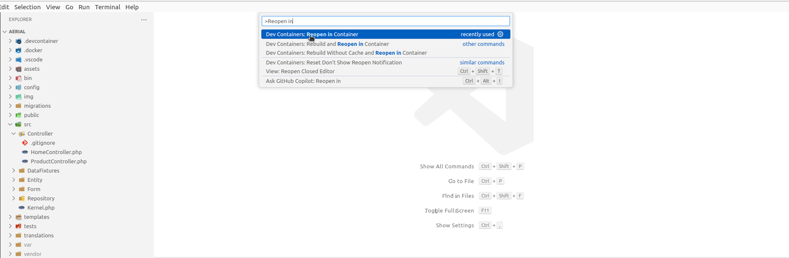
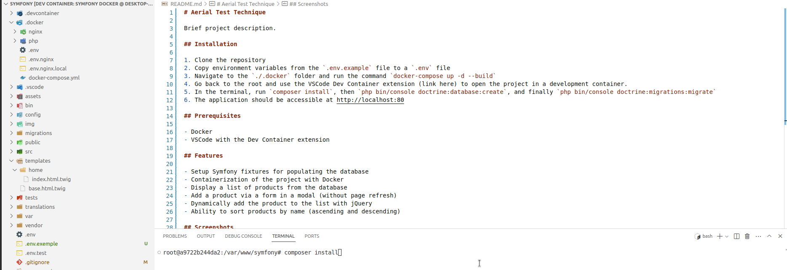

# Aerial Test Technique

## Installation

1. Clone the repository
2. Copy environment variables from the `.env.example` file to a `.env` file
3. Navigate to the `./.docker` folder and run the command `docker compose up -d --build`
4. Go back to the root and use the VSCode Dev Container extension ([Dev Containers](https://marketplace.visualstudio.com/items?itemName=ms-vscode-remote.remote-containers)) to open the project in a development container.
5. Open VSCode settings and search "Reopen in Container"
   
6. In the terminal, run `composer install`
   
7. Then `php bin/console doctrine:database:create`
8. Then `php bin/console doctrine:migrations:migrate` and type yes in the prompt
9. Finally `php bin/console doctrine:fixtures:load` to populate database, type yes in the prompt
9. The application should be accessible at http://localhost:80

## Prerequisites

- Docker
- VSCode with the Dev Container extension

## Features

- Setup Symfony fixtures for populating the database
- Containerization of the project with Docker
- Display a list of products from the database
- Add a product via a form in a modal (without page refresh)
- Dynamically add the product to the list with jQuery
- Ability to sort products by name (ascending and descending)